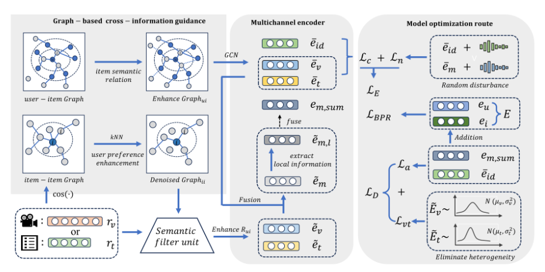

# LMNM: Latent Preference Mining and Noise-aware for Multimodal Recommendation

<!-- PROJECT LOGO -->

## Introduction

This is the Pytorch implementation for our LMNM paper:


## Environment Requirement
- python 3.9.2
- Pytorch 2.1.0

## Dataset

We provide four processed datasets: Baby, Sports, Clothing.

Download from Google Drive: [Baby/Sports/Clothing](https://drive.google.com/drive/folders/1_j7du9KX30S9PwX8jmHlTmhxOof5WTnS?role=writer)

## Training
  ```
  cd ./src
  python main.py
  ```
## MODEL image


## Acknowledgement
The structure of this code is  based on [MMRec](https://github.com/enoche/MMRec). Thank for their work.
